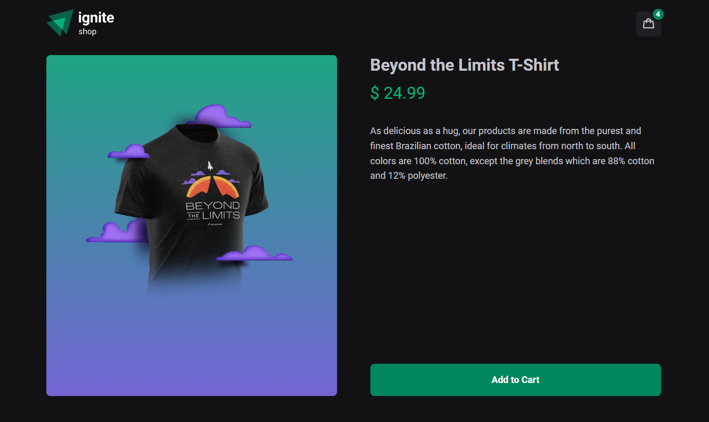

<h1 align="center">
   
  
    
  

    
    
    
    
  

</h1>

## ✨ Description

This app was designed to simulate an e-commerce store, integrating the Stripe API to handle checkout payments. 
Developed as a challenge during the "Ignite - ReactJS" bootcamp by [@Rocketseat](https://www.rocketseat.com.br).

## 🚀 Technologies
-  React
    -  States, hooks, props
-  Next.js
    -  SSR, SSG, API Routes
-  Axios
-  TypeScript
-  Stitches
-  useShoppingCart

## 💻 Installation

After cloning/downloading this repository, open your terminal, navigate to the project's directory then run:

-  `npm install` - To install packages dependencies
-  `npm run dev` - To run the application on your localhost

## 🌟 Preview

